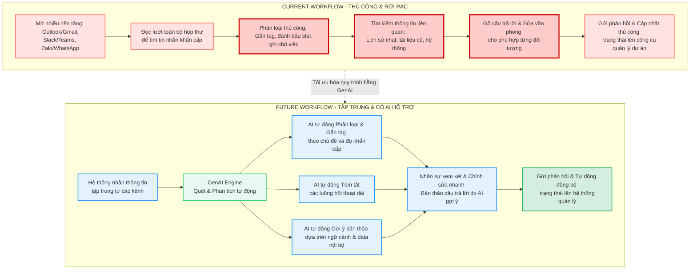
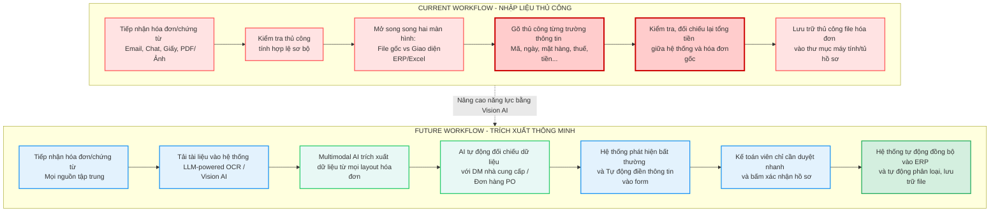

# 01 – Individual Problem Scan

## Scan rộng

| # | Lăng kính | Problem quan sát được | Ai đang đau? | Dấu hiệu thật |
|---|---|---|---|---|
| 1 | Tốn thời gian | Xử lý hàng trăm Email và Tin nhắn mỗi ngày | HR | Mất 1-2 tiếng mỗi ngày |
| 2 | Tốn thời gian | Nhập liệu thủ công (Data Entry) từ Hóa đơn/Chứng từ | Accountant | Lặp lại mỗi ngày |
| 3 | Tốn thời gian | Quản lý tài chính cá nhân và Phân loại chi tiêu | User | Lặp lại mỗi ngày |
| 4 | Tốn thời gian | Sàng lọc thông tin và Đọc hiểu tài liệu dài | PM, team member | 1-2 ngày/ tài liệu |
| 5 | AI có thể tốt hơn | Theo dõi và Nhắc nhở mục tiêu cá nhân | User | Sẽ có thể quên trong ngày |
| 6 | AI có thể tốt hơn | Lên lộ trình du lịch cá nhân hóa | User | Lộ trình không tối ưu |

# Top 3

| Rank | Problem | Vì sao chọn | Điều còn chưa chắc |
|------|---------|-------------|-------------------|
| 1 | Xử lý hàng trăm Email và Tin nhắn mỗi ngày | Workflow rõ, mất nhiều thời gian, có metric tốt | Nếu phân loại sai 1 email quan trọng thì sẽ gây ra ảnh hưởng lớn |
| 2 | Nhập liệu thủ công (Data Entry) từ Hóa đơn/Chứng từ | Tác vụ đơn gian nhưng mất nhiều thời gian | Rủi ro lớn nếu thông tin bị sai |
| 3 | Sàng lọc thông tin và Đọc hiểu tài liệu dài | Giúp giảm thời gian đáng kể để nắm bắt thông tin từ tài liệu | Sẽ không hiểu được chuyên sâu nếu chỉ đọc tóm tắt |

# Problem Card #1 – Email & Message Management

### Bài toán một câu:
Mỗi ngày, nhân sự mất từ 2 đến 3 tiếng chỉ để đọc, phân loại và trả lời hàng trăm email và tin nhắn từ nhiều kênh khác nhau, dẫn đến việc quá tải thông tin, phản hồi chậm và dễ bỏ sót các yêu cầu quan trọng.

### Actor:
Account Manager, Project Manager, Operations Specialist, hoặc các vị trí cần giao tiếp liên tục với khách hàng và nội bộ.

### Thời điểm / bối cảnh:
Diễn ra liên tục trong suốt ngày làm việc, đặc biệt cao điểm vào đầu giờ sáng (xử lý backlog từ hôm trước) và cuối giờ chiều.

### Current workflow:
1. Mở đồng thời nhiều nền tảng giao tiếp (Outlook/Gmail, Slack/Teams, Zalo/WhatsApp).
2. Đọc lướt qua toàn bộ hộp thư để nhận diện các tin nhắn khẩn cấp.
3. Phân loại thủ công bằng cách gắn tag, đánh dấu star hoặc ghi chú lại các việc cần xử lý.
4. Tìm kiếm thông tin liên quan (lịch sử chat, file tài liệu cũ, dữ liệu hệ thống) để chuẩn bị nội dung phản hồi.
5. Gõ câu trả lời, chỉnh sửa văn phong cho phù hợp với từng đối tượng (khách hàng, cấp trên, đồng nghiệp).
6. Gửi phản hồi và cập nhật trạng thái công việc lên công cụ quản lý dự án (nếu có).

### Bottleneck:
* **Bước 3 & 4:** Quá tải nhận thức khi phải liên tục chuyển đổi ngữ cảnh (context-switching) giữa các kênh khác nhau để thu thập dữ liệu.
* **Bước 5:** Mất nhiều thời gian để suy nghĩ, soạn thảo văn bản, viết các email lặp đi lặp lại hoặc điều chỉnh văn phong cho chuyên nghiệp.

### Impact:
* Tiêu tốn ~10 - 15 tiếng/tuần cho mỗi nhân sự (chỉ tính riêng cho việc đọc và phản hồi text).
* Tốc độ phản hồi (SLA) bị chậm, làm giảm trải nghiệm của khách hàng hoặc gây nghẽn tiến độ phối hợp giữa các phòng ban.
* Nhân sự dễ rơi vào trạng thái kiệt sức (burnout) do ngập tràn thông tin, giảm thời gian dành cho các công việc mang tính chiến lược hoặc chuyên môn sâu.

### Success metric:
Giảm tổng thời gian xử lý email/tin nhắn xuống dưới 45 phút/ngày, nâng tỷ lệ phản hồi đúng hạn (SLA) lên trên 95%, và đảm bảo 0% tỷ lệ bỏ sót các tin nhắn khẩn cấp.

### Non-AI alternative:
Sử dụng bộ mẫu email chuẩn (Canned Responses), thiết lập bộ lọc tự động (Filter/Rules) có sẵn của Gmail/Outlook, hoặc quy định khung giờ cố định trong ngày để check mail. Tuy nhiên, giải pháp này không xử lý được các yêu cầu phức tạp, mang tính cá nhân hóa hoặc tin nhắn phi cấu trúc trên các chat app.

### AI hypothesis:
* AI tự động quét, phân tích và phân loại tin nhắn theo mức độ khẩn cấp và chủ đề (Tagging & Triaging).
* AI tóm tắt các luồng hội thoại dài, nhiều tin nhắn chồng chéo thành các ý chính (Thread Summarization).
* AI tự động gợi ý bản thảo phản hồi (Draft reply) dựa trên ngữ cảnh và cơ sở dữ liệu nội bộ để nhân sự chỉ cần xem xét, chỉnh sửa nhanh trước khi gửi.

### Phán đoán ban đầu:
Workflow & Capability (Tối ưu hóa quy trình tiếp nhận thông tin kết hợp với khả năng đọc hiểu và sinh văn bản của GenAI).

### 1. Sơ đồ quy trình cho Problem Card #1: Email & Message Management



# Problem Card #2 – Manual Data Entry from Invoices & Documents

### Bài toán một câu:
Mỗi tháng, kế toán và nhân sự vận hành phải dành hàng chục giờ đồng hồ để nhập liệu thủ công hàng trăm hóa đơn, chứng từ giấy hoặc file PDF vào hệ thống kế toán/ERP, dẫn đến tốc độ xử lý chậm, dễ sai sót số liệu và gây nghẽn quy trình thanh toán.

### Actor:
Kế toán viên (Accountant), Nhân viên hành chính (Administrative Assistant), Chuyên viên vận hành (Operations Specialist).

### Thời điểm / bối cảnh:
Diễn ra liên tục trong tháng, cao điểm vào tuần cuối tháng hoặc tuần đầu tháng kế tiếp khi đến kỳ chốt sổ, đối soát công nợ và báo cáo thuế.

### Current workflow:
1. Tiếp nhận hóa đơn/chứng từ từ nhiều nguồn (Email, Chat app, Hóa đơn giấy, File PDF/Ảnh scan).
2. Kiểm tra tính hợp lệ sơ bộ của hóa đơn (thông tin công ty, mã số thuế, chữ ký số).
3. Mở song song hai màn hình: Một bên là file hóa đơn/chứng từ, một bên là giao diện hệ thống (Excel, MISA, SAP, Oracle...).
4. Gõ thủ công từng trường thông tin: Mã hóa đơn, Ngày phát hành, Thông tin nhà cung cấp, Danh sách mặt hàng, Số lượng, Đơn giá, Thuế suất (VAT), Tổng tiền.
5. Kiểm tra, đối chiếu lại tổng tiền trên hệ thống xem có khớp với hóa đơn gốc hay không.
6. Lưu trữ/Lưu file hóa đơn gốc vào thư mục máy tính hoặc tủ hồ sơ theo quy định.

### Bottleneck:
* **Bước 4 & 5:** Tốn quá nhiều thời gian cho việc gõ phím và rà soát lỗi. Hóa đơn nhiều dòng hàng (line-items) phức tạp rất dễ bị nhập sai lệch số 0 hoặc dấu phẩy, gây mất thời gian tìm lỗi và sửa sai ở các bước sau.

### Impact:
* Tiêu tốn từ 20 - 40 tiếng/tháng cho mỗi nhân sự chỉ để làm các tác vụ lặp đi lặp lại, không tạo ra giá trị gia tăng.
* Tỷ lệ sai sót do yếu tố con người (human error) dao động từ 2% - 5%, có thể dẫn đến báo cáo tài chính sai, bị phạt thuế hoặc thanh toán nhầm cho nhà cung cấp.
* Tiến độ phê duyệt và thanh toán bị chậm, gây ảnh hưởng đến mối quan hệ với nhà cung cấp và đối tác.

### Success metric:
Giảm 80% thời gian nhập liệu (xuống dưới 2 phút/hóa đơn bao gồm cả thời gian duyệt), kiểm soát tỷ lệ sai sót số liệu đầu vào ở mức dưới 0.5%.

### Non-AI alternative:
* Sử dụng các phần mềm OCR (Nhận dạng ký tự quang học) truyền thống dựa trên template cố định (Rule-based OCR). Tuy nhiên, giải pháp này sẽ "gãy" ngay khi nhà cung cấp thay đổi layout hóa đơn hoặc khi gặp các định dạng chứng từ lạ, đòi hỏi phải cấu hình lại rất mất thời gian.
* Thuê các bên dịch vụ nhập liệu bên ngoài (Outsourcing) -> Tốn chi phí cố định cao và rủi ro rò rỉ dữ liệu tài chính bảo mật.

### AI hypothesis:
* **LLM-powered OCR / Vision AI:** Sử dụng AI có khả năng đọc hiểu hình ảnh (Multimodal AI) để tự động trích xuất chính xác các trường thông tin cần thiết từ bất kỳ layout hóa đơn nào (không cần cài đặt template trước).
* **Auto-mapping & Validation:** AI tự động đối chiếu thông tin trích xuất được với danh mục nhà cung cấp/đơn đặt hàng (PO) hiện có trên hệ thống để phát hiện bất thường (ví dụ: chênh lệch giá, sai mã số thuế) và tự động điền (auto-fill) vào form nhập liệu.

### Phán đoán ban đầu:
Capability (Trọng tâm nằm ở năng lực xử lý thị giác máy tính và trích xuất dữ liệu phi cấu trúc thông minh của AI).

### Sơ đồ quy trình hiện tại vs Tương lai (Mermaid)


### Problem Card #3 – Document Reading & Information Screening

### Bài toán một câu:
Mỗi tuần, nhân sự chuyên môn mất từ 4 đến 6 tiếng chỉ để đọc các bộ tài liệu dài hàng chục trang (báo cáo thị trường, văn bản pháp lý, tài liệu kỹ thuật), dẫn đến việc quá tải thông tin, tốn thời gian sàng lọc và dễ bỏ sót các điều khoản hoặc dữ liệu cốt lõi.

### Actor:
Business Analyst (BA), Legal Specialist (Chuyên viên pháp lý), Nghiên cứu viên (Researcher), Investment Analyst (Chuyên viên phân tích đầu tư).

### Thời điểm / bối cảnh:
Diễn ra khi bắt đầu nghiên cứu dự án mới, rà soát hợp đồng trước khi ký kết, hoặc khi cần cập nhật các quy định, thông tư pháp luật mới ban hành từ chính phủ/đối tác.

### Current workflow:
1. Tiếp nhận tài liệu dưới dạng file PDF, Word, hoặc Slide dài từ 30 đến hơn 100 trang.
2. Đọc lướt qua mục lục và các tiêu đề lớn để định vị sơ bộ cấu trúc tài liệu.
3. Đọc chi tiết từng trang, dùng công cụ Highlight để đánh dấu các con số, định nghĩa, hoặc điều khoản quan trọng.
4. Ghi chép (take note) thủ công các ý chính ra một file Doc hoặc Excel riêng biệt để tổng hợp.
5. Đối chiếu thông tin vừa đọc với các quy định hoặc tiêu chuẩn hiện tại của công ty để đánh giá mức độ tương thích/rủi ro.
6. Viết một bản tóm tắt ngắn (Executive Summary) để báo cáo cho Quản lý hoặc Ban giám đốc.

### Bottleneck:
* **Bước 3 & 4:** Tốn cực kỳ nhiều thời gian và năng lượng não bộ để duy trì sự tập trung qua hàng trăm trang text. Rất dễ bị hiện tượng "blind spots" (bỏ sót thông tin quan trọng ở các chương giữa) hoặc hiểu sai ngữ cảnh do tài liệu sử dụng nhiều thuật ngữ chuyên ngành phức tạp.

### Impact:
* Gây chậm trễ trong khâu ra quyết định kinh doanh hoặc thẩm định dự án (mất từ 2-3 ngày chỉ để đọc hiểu xong một bộ tài liệu).
* Rủi ro pháp lý hoặc tài chính nghiêm trọng nếu bỏ sót các điều khoản ràng buộc ẩn (fine print) hoặc các số liệu cập nhật nhỏ nhưng có tính quyết định.
* Nhân sự bị kiệt quệ về mặt nhận thức (cognitive fatigue), giảm hiệu suất làm việc ở các tác vụ phân tích sâu sau đó.

### Success metric:
Giảm 70% thời gian đọc và sàng lọc tài liệu ban đầu (từ 5 tiếng xuống dưới 1.5 tiếng/tài liệu dài), trích xuất chính xác 100% các Key Metrics hoặc các điều khoản rủi ro mà không cần đọc hết từ đầu đến cuối.

### Non-AI alternative:
* Sử dụng tính năng "Ctrl + F" để tìm kiếm từ khóa. Tuy nhiên, cách này chỉ hiệu quả nếu biết chính xác từ khóa cần tìm, hoàn toàn bất lực trước việc hiểu ngữ cảnh, tổng hợp ý nghĩa hoặc khi từ khóa được viết bằng các từ đồng nghĩa khác.
* Thuê ngoài (Outsource) dịch vụ tóm tắt hoặc phân tích -> Chi phí cao, mất thời gian bàn giao và vi phạm nghiêm trọng quy định bảo mật thông tin tài liệu nội bộ.

### AI hypothesis:
* **Long-context Comprehension & Retrieval (RAG):** Ứng dụng LLM có cửa sổ ngữ cảnh lớn (Long-context Window) để đọc toàn bộ tài liệu cùng lúc, cho phép người dùng đặt câu hỏi trực tiếp (Chat with Document) để tìm kiếm thông tin theo ngữ nghĩa thay vì từ khóa thuần túy.
* **Smart Summarization & Structure:** AI tự động phân tích và xuất ra bản tóm tắt đa tầng (Tổng quan -> Ý chính -> Chi tiết số liệu) theo đúng khung phân tích mà nhân sự yêu cầu.
* **Anomalies Detection:** AI tự động quét và gắn cờ cảnh báo (Flagging) các điều khoản bất thường, các chỉ số vượt ngưỡng hoặc các điểm mâu thuẫn trong tài liệu.

### Phán đoán ban đầu:
Capability (Dựa vào năng lực xử lý ngữ cảnh dài, trích xuất thông tin chính xác và khả năng suy luận ngữ nghĩa của các mô hình ngôn ngữ lớn thế hệ mới).


### Sơ đồ quy trình hiện tại vs Tương lai (Mermaid)

```mermaid
graph TB
    %% Định nghĩa Style cho các thành phần
    classDef current fill:#f9f,stroke:#333,stroke-width:2px;
    classDef future fill:#bbf,stroke:#333,stroke-width:2px;
    classDef bottleneck fill:#ff9999,stroke:#333,stroke-width:2px;
    classDef ai fill:#99ffd8,stroke:#333,stroke-width:2px;
    classDef success fill:#99ff99,stroke:#333,stroke-width:2px;

    subgraph CURRENT_WORKFLOW [CURRENT WORKFLOW - MANUAL & FRAGMENTED]
        A[Tiếp nhận tài liệu dài <br> PDF/Word/Slide 30-100+ trang] --> B[Đọc lướt mục lục & tiêu đề <br> Định vị cấu trúc sơ bộ]
        B --> C[Đọc chi tiết từng trang & Highlight <br> Con số, định nghĩa, điều khoản]:::bottleneck
        C --> D[Ghi chép Note thủ công <br> Ra file Doc/Excel riêng]:::bottleneck
        D --> E[Đối chiếu quy định công ty <br> Đánh giá rủi ro/tương thích]
        E --> F[Viết bản tóm tắt ngắn <br> Executive Summary]
        F --> G[Báo cáo Quản lý / Ban giám đốc <br> Ra quyết định muộn]
        
        %% Chú thích Bottleneck
        style C stroke:#ff3333,stroke-width:3px;
        style D stroke:#ff3333,stroke-width:3px;
    end

    subgraph FUTURE_WORKFLOW [FUTURE WORKFLOW - AI-ASSISTED & UNIFIED]
        A2[Tiếp nhận tài liệu dài <br> PDF/Word/Slide 30-100+ trang] --> B2[Tải tài liệu vào Hệ thống AI <br> Long-context Window / RAG]
        
        B2 --> C2{AI Tự động xử lý}:::ai
        
        C2 -->|Smart Summarization| D2[Xuất bản tóm tắt đa tầng <br> Tổng quan -> Ý chính -> Số liệu]
        C2 -->|Semantic Search| E2[Chat với tài liệu <br> Trích xuất Key Metrics/Thông tin]
        C2 -->|Anomalies Detection| F2[Gắn cờ cảnh báo <br> Điều khoản bất thường/Rủi ro]
        
        D2 --> G2[Nhân sự Review & Kiểm chứng nhanh]
        E2 --> G2
        F2 --> G2
        
        G2 --> H2[Xuất báo cáo chất lượng cao <br> Ra quyết định nhanh chóng]:::success
    end

    %% Kết nối 2 quy trình để thấy sự tối ưu
    CURRENT_WORKFLOW -.->|Chuyển đổi giải pháp| FUTURE_WORKFLOW