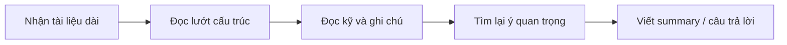
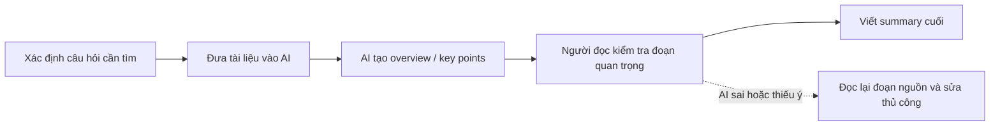

<!-- # Phase 3 — Group Convergence: từ 9-12 candidates về 1

## Mục tiêu

Nhóm 3-4 người sẽ có khoảng 9-12 candidate problems. Không vote ngay. Đi qua 4 bước hội tụ:

```text
Trình bày top 3
→ gom trùng / cluster
→ shortlist
→ chấm nhanh + đồng thuận chọn 1 candidate problem
```

Nhóm lúc này **chỉ chọn candidate problem**, chưa viết Problem Statement hoàn chỉnh. -->

## Bước 3.1

| # | Người đưa ra | Candidate problem | Người gặp vấn đề | Điểm nghẽn | Cảm nhận nhanh |
|---|---|---|---|---|---|
| 1 | Khiêm | Theo dõi deadline rải rác nhiều app | Học viên có nhiều bài/lab cùng lúc | Tự tổng hợp deadline và việc cần làm từ LMS, Discord, Calendar, note cá nhân | Workflow rõ, xảy ra thường xuyên, impact dễ đo |
| 2 | Khiêm | Theo dõi chi tiêu rải rác giữa app ngân hàng, ví điện tử, tiền mặt và ghi chú | Sinh viên/người trẻ muốn kiểm soát tiền hằng tháng | Nhập lại và phân loại khoản chi thủ công từ nhiều nguồn | Pain lặp lại, metric dễ đo bằng thời gian tổng hợp |
| 3 | Khiêm | Lên kế hoạch đi ăn/đi chơi nhóm từ sở thích, ngân sách, vị trí và lịch rảnh | Nhóm bạn hoặc nhóm học chung | Gom ý kiến không đồng bộ và tự lọc địa điểm phù hợp | Có nhiều người tham gia, bottleneck rõ |
| 4 | Chí | Email & Message Management | Accounnt Manager, PM | Phải đọc, phân loại và trả lời hàng trăm tin nhắn và email khác nhau | Khá phổ biến |
| 5 | Chí | Manual Data Entry from Invoices & Doc | Accountant | Nhập thủ công hàng trăm hóa đơn mất nhiều thời gian | Pain phổ biến với doanh nghiệp vừa và nhỏ |
| 6 | Chí | Documents Reading & Information Screening | Học viên, PM | Mất nhiều thời gian để đọc tài liệu | Dễ gây mất thông tin |
| 7 | Kiên | Chat nhầm channel → thông tin rối loạn trong Discord | Sinh viên trong nhóm học | Thông tin cập nhật nằm rải rác nhiều channel, khó theo dõi tiến độ; phải hỏi lại nhiều lần hoặc scroll chat để tìm update cũ | Pain xảy ra thường xuyên trong nhóm học/lab, workflow rõ, ảnh hưởng coordination |
| 8 | Kiên | Deadline / requirement bị trôi trong Discord | Sinh viên trong nhóm học  | Thông tin quan trọng bị chìm trong chat hoặc tài liệu dài; mất thời gian tìm requirement đúng phiên bản, dẫn đến hỏi lặp lại | Pain lặp lại nhiều lần, boundary rõ (Discord/LMS), có thể đo bằng số câu hỏi lặp hoặc thời gian tìm thông tin |
| 9 | Kiên | Discord search kém, khó tìm tài liệu hoặc quyết định cũ | Học viên muốn kiểm tra bài trước khi nộp | Phải dò lại chat thủ công để tìm rubric/checklist/quyết định cũ; search theo keyword không hiệu quả hoặc thiếu context | Có workflow cụ thể trước khi nộp bài, dễ validate qua thời gian tìm tài liệu hoặc số lần hỏi lại |
| 10 | Mạnh | Mỗi tuần tổng hợp tiến độ dự án từ nhiều nguồn (Jira, Slack, Teams, Discord) vào report | Team lead, project manager | Mất 60-90 phút/tuần, hay viết narrative lâu, thường trễ deadline | Workflow rõ nhất |
| 11 | Mạnh | Đọc và tóm tắt tài liệu dài hoặc nghiên cứu phức tạp với nhiều thuật ngữ chuyên ngành | Student, researcher | Mất 45-60 phút/tài liệu, khó hiểu overview nhanh | Demo nhanh |
| 12 | Mạnh | Mỗi lần bắt đầu project/khoá mới phải viết lại setup instruction từ đầu hoặc tìm lại cũ | Developer, student, new team member | Tốn nhiều thời gian setup, hay bỏ sót bước hoặc version mismatch | Lặp lại rõ ràng |

## Bước 3.2 — Gom trùng / cluster

| Cluster | Candidates included | Pattern chung | Ghi chú |
|---|---|---|---|
| A. Theo dõi deadline / requirement / cập nhật trong Discord | Theo dõi deadline rải rác nhiều app; Chat nhầm channel → thông tin rối loạn trong Discord; Deadline / requirement bị trôi trong Discord | Thông tin quan trọng nằm rải rác ở LMS, Discord, Calendar, note hoặc nhiều channel nên người học phải tự gom lại | Nhóm này trùng pain học tập rõ nhất, có thể đo bằng thời gian tìm deadline và số lần hỏi lại |
| B. Tìm kiếm tài liệu / quyết định / thông tin cũ | Discord search kém, khó tìm tài liệu hoặc quyết định cũ; Documents Reading & Information Screening; Đọc và tóm tắt tài liệu dài hoặc nghiên cứu phức tạp | Người dùng cần tìm đúng ý trong tài liệu/chat dài nhưng search theo keyword hoặc đọc thủ công mất thời gian | Cần giới hạn nguồn dữ liệu để không bị quá rộng |
| C. Báo cáo / tổng hợp tiến độ từ nhiều nguồn | Mỗi tuần tổng hợp tiến độ dự án từ nhiều nguồn vào report | Gom thông tin từ Jira, Slack, Teams, Discord rồi viết lại thành report có narrative | Workflow rất rõ, impact đo được bằng 60-90 phút/tuần |
| D. Nhập liệu / chuẩn hóa dữ liệu thủ công | Theo dõi chi tiêu rải rác giữa app ngân hàng, ví điện tử, tiền mặt và ghi chú; Manual Data Entry from Invoices & Doc | Dữ liệu nằm ở nhiều nguồn hoặc nhiều định dạng, người dùng phải nhập lại và phân loại thủ công | Có pain lặp lại, nhưng domain tài chính/kế toán cần kiểm lỗi cẩn thận |
| E. Planning / coordination nhóm | Lên kế hoạch đi ăn/đi chơi nhóm từ sở thích, ngân sách, vị trí và lịch rảnh; Email & Message Management | Nhiều người/nhiều luồng thông tin cần được gom, phân loại và chốt hành động tiếp theo | Workflow có nhiều actor, dễ phát sinh thiếu phản hồi hoặc thông tin bị trôi |
| F. Setup / hướng dẫn lặp lại | Mỗi lần bắt đầu project/khoá mới phải viết lại setup instruction từ đầu hoặc tìm lại cũ | Kiến thức setup nằm rải rác, người mới dễ thiếu bước hoặc dùng sai version | Pain lặp lại rõ nhưng cần chọn một project/khoá cụ thể để làm trong lab |

## Bước 3.3 — Shortlist

| Candidate | Vì sao vào shortlist | Rủi ro / điều chưa rõ |
|---|---|---|
| Documents Reading & Information Screening | Nhiều actor gặp pain khi phải đọc tài liệu dài để tìm ý chính hoặc thông tin cần thiết; workflow có thể vẽ rõ từ nhận tài liệu → đọc → lọc ý → ghi lại thông tin | Cần giới hạn loại tài liệu và tiêu chí "thông tin quan trọng" để không bị quá rộng |
| Mỗi tuần tổng hợp tiến độ dự án từ nhiều nguồn vào report | Workflow rõ nhất, lặp lại hằng tuần, bottleneck nằm ở bước gom thông tin từ Jira, Slack, Teams, Discord và viết narrative; impact đo được bằng 60-90 phút/tuần | Cần xác định nguồn dữ liệu mẫu trong lab và format report đầu ra |
| Lên kế hoạch đi ăn/đi chơi nhóm từ sở thích, ngân sách, vị trí và lịch rảnh | Có nhiều người tham gia, bottleneck là gom ý kiến không đồng bộ và chốt phương án; có thể so sánh rule/form/workflow/AI | Cần validate xem nhóm thật sự muốn tối ưu hay chỉ chấp nhận chat thủ công |

## Bước 3.4 — Score để đồng thuận

| Candidate | Actor rõ | Workflow rõ | Pain có evidence | Impact đo được | Làm trong lab | So sánh R/W/A được | Nhóm hiểu domain | Tổng |
|---|---:|---:|---:|---:|---:|---:|---:|---:|
| Documents Reading & Information Screening | 5 | 5 | 4 | 5 | 5 | 5 | 5 | 34 |
| Mỗi tuần tổng hợp tiến độ dự án từ nhiều nguồn vào report | 5 | 5 | 5 | 5 | 4 | 5 | 4 | 33 |
| Lên kế hoạch đi ăn/đi chơi nhóm từ sở thích, ngân sách, vị trí và lịch rảnh | 5 | 4 | 4 | 4 | 4 | 5 | 5 | 31 |

Candidate nhóm chọn:

```text
Documents Reading & Information Screening
```

Vì sao chọn:

```text
Nhóm chọn Documents Reading & Information Screening vì actor rõ là học viên, PM hoặc người cần đọc nhanh tài liệu dài để lấy thông tin quan trọng.
Workflow hiện tại dễ quan sát: nhận tài liệu → đọc toàn bộ → highlight/ghi chú → tìm thông tin cần thiết → tóm tắt hoặc ra quyết định.
Bottleneck nằm ở bước đọc và lọc thông tin, mất khoảng 45-60 phút/tài liệu và dễ bỏ sót ý quan trọng.
Trong lab, nhóm có thể dùng một tài liệu mẫu, đo thời gian đọc/tóm tắt trước-sau, và so sánh được Rule / Workflow / Agent rõ.
```

Vì sao không chọn các candidate còn lại:

```text
Mỗi tuần tổng hợp tiến độ dự án từ nhiều nguồn vào report có workflow rất rõ nhưng cần nhiều nguồn dữ liệu mẫu như Jira, Slack, Teams, Discord nên khó chuẩn bị đầy đủ trong lab.
Lên kế hoạch đi ăn/đi chơi nhóm có nhiều actor và bottleneck rõ, nhưng impact thường nhỏ hơn và phụ thuộc nhiều vào phản hồi của từng người trong nhóm.
```

---

# Phase 4 — Quick Validation + Research giải pháp

## Bước 4.1 — Quick validation

| Nguồn | Số người / số mẫu | Tín hiệu xác nhận | Tín hiệu phản bác | Nhóm sửa problem thế nào |
|---|---:|---|---|---|
| Interview | Dự kiến hỏi nhanh 2-3 bạn trong lớp/nhóm | Nhiều bạn hay phải đọc worksheet, PDF, tài liệu lab hoặc PRD dài để tìm đúng ý cần dùng | Nếu tài liệu ngắn hoặc đã có summary tốt thì pain không lớn | Giới hạn vào tài liệu dài/khó đọc, không áp dụng cho mọi loại tài liệu |
| Survey / poll | Chưa làm poll chính thức | Có thể hỏi thêm: "Bạn mất bao lâu để đọc tài liệu dài và rút ý chính?" | Chưa có số liệu đủ chắc để kết luận mạnh | Không dùng số liệu giả; chỉ xem đây là giả định cần kiểm chứng thêm |
| Log / review / ticket | Quan sát từ bài học và project nhóm | Khi đọc tài liệu dài, người đọc thường phải highlight, ghi chú, rồi tìm lại đoạn nguồn | AI summary có thể sai nếu người đọc không kiểm lại nguồn | Problem tập trung vào hỗ trợ đọc nhanh và tìm ý, không thay người đọc quyết định |

## Bước 4.2 — Research giải pháp đã có

| Nguồn / tool / case | Link | Họ giải quyết phần nào? | Điểm mạnh | Khoảng trống / rủi ro | Bài học cho nhóm |
|---|---|---|---|---|---|
| Google NotebookLM | [NotebookLM](https://notebooklm.google/) | Upload nguồn, tóm tắt, hỏi đáp theo tài liệu | Hữu ích khi đọc nhiều tài liệu và muốn hỏi theo nguồn | Nếu nguồn đưa vào thiếu thì câu trả lời cũng thiếu | Cần chọn nguồn đúng trước khi hỏi AI |
| Adobe Acrobat AI Assistant | [Adobe Acrobat](https://www.adobe.com/acrobat/generative-ai-pdf.html) | Tóm tắt PDF và hỏi đáp nội dung trong file | Phù hợp với tài liệu PDF dài | Người dùng vẫn phải kiểm tra lại đoạn quan trọng | Output nên có nguồn/đoạn để kiểm chứng |
| Microsoft Copilot / ChatGPT document summary | [Microsoft Support](https://support.microsoft.com/en-gb/office/summarize-your-files-with-copilot-10dcbe50-467d-4a61-9d5e-c98c77fd33a4) | Tóm tắt file và rút ý chính | Dễ dùng để đọc nhanh overview | Có thể bỏ sót chi tiết hoặc hiểu sai ngữ cảnh | AI nên dùng để định hướng đọc, không thay đọc kỹ phần quan trọng |

---

# Phase 5 — Workflow + Problem Statement

## Bước 5.1 — Current workflow bản nhóm



| Bước | Actor | Input | Output | Thời gian/tần suất | Ghi chú |
|---|---|---|---|---|---|
| 1 | Học viên / PM | PDF, worksheet, PRD, tài liệu lab | Tài liệu cần đọc | Mỗi khi có tài liệu mới | Chưa biết đoạn nào quan trọng |
| 2 | Học viên / PM | Tiêu đề, mục lục, heading | Hiểu sơ cấu trúc tài liệu | 5-10 phút | Nếu tài liệu dài thì vẫn khó nắm nhanh |
| 3 | Học viên / PM | Nội dung tài liệu | Highlight, note, ý chính | 30-45 phút | Đây là bước tốn thời gian nhất |
| 4 | Học viên / PM | Note và tài liệu gốc | Đoạn/ý cần dùng | 5-10 phút | Hay phải kéo lại để tìm nguồn |
| 5 | Học viên / PM | Ý đã chọn | Summary hoặc câu trả lời cuối | 5-10 phút | Có thể thiếu ý nếu đọc sót |

Bottleneck chính:

```text
Người đọc mất nhiều thời gian ở bước đọc kỹ, lọc ý quan trọng và tìm lại đoạn nguồn. Với tài liệu dài, tổng thời gian thường khoảng 45-60 phút.
```

## Bước 5.2 — Future workflow bản nhóm



Before/after impact:

| Metric | Trước | Sau kỳ vọng | Ghi chú |
|---|---:|---:|---|
| Số bước | 5 | 5 | Bước không đổi, nhưng đọc có định hướng hơn |
| Tổng thời gian | 45-60 phút/tài liệu | 25-40 phút/tài liệu | Mục tiêu giảm thời gian đọc/lọc |
| Số bước thủ công | 5 | 3 | Người đọc vẫn đặt câu hỏi, kiểm nguồn, chốt summary |
| Bottleneck chính | Đọc toàn bộ và tự lọc ý | Kiểm tra lại ý AI gợi ý | Vẫn cần người thật kiểm tra |
| Risk mới | Đọc sót do tài liệu dài | AI tóm tắt sai hoặc bỏ sót chi tiết | Phải mở lại nguồn trước khi dùng |

## Bước 5.3 — Problem Statement v0

| Field | Nội dung |
|---|---|
| **Actor** | Học viên hoặc PM cần đọc tài liệu dài để tìm ý chính |
| **Workflow** | Nhận tài liệu, đọc lướt, đọc kỹ, ghi chú, tìm lại ý quan trọng, viết summary/câu trả lời |
| **Bottleneck** | Đọc và lọc thông tin thủ công mất thời gian, dễ bỏ sót ý hoặc khó tìm lại nguồn |
| **Impact** | Mất khoảng 45-60 phút/tài liệu; summary có thể thiếu ý hoặc không có nguồn kiểm lại |
| **Success Metric** | Giảm thời gian đọc/lọc xuống 25-40 phút/tài liệu; các ý chính có nguồn để kiểm chứng |
| **Boundary** | Chỉ hỗ trợ tài liệu học tập/project thông thường; không dùng cho tài liệu high-stakes nếu không có người có chuyên môn kiểm tra |

---

# Phase 6 — Rule / Workflow / Agent + Decision

## Bước 6.0 — Ma trận độ phù hợp với AI để suy nghĩ nhanh

Bài toán của nhóm nằm ở ô nào?

```text
Độ mơ hồ cao + độ phức tạp trung bình.
```

Vì sao?

```text
Tóm tắt tài liệu có nhiều cách viết đúng, nên độ mơ hồ cao. Workflow có vài bước rõ ràng và không cần AI tự quyết định bước tiếp theo, nên chưa cần Agent.
```

## Bước 6.1 — So sánh Rule / Workflow / Agent

| Mức | Phương án cho bài toán nhóm | Khi nào đủ | Rủi ro | Chọn? |
|---|---|---|---|---|
| **Rule** | Dùng checklist đọc tài liệu: mục tiêu đọc, 5 ý chính, câu hỏi còn lại, nguồn tham chiếu | Đủ với tài liệu ngắn hoặc dễ đọc | Không giảm nhiều thời gian với tài liệu dài | Không |
| **Workflow** | Người đọc đặt câu hỏi, AI tạo overview/key points, người đọc kiểm nguồn và viết summary cuối | Đủ vì các bước rõ và có người kiểm tra | AI có thể tóm tắt sai hoặc bỏ sót ý | Có |
| **Agent** | AI tự đọc, tự đặt câu hỏi, tự tìm thêm nguồn và tự viết note cuối | Chỉ cần khi phải nghiên cứu nhiều nguồn phức tạp | Quá rộng, khó kiểm soát, dễ dùng sai nguồn | Không |

Mức chọn:

```text
Workflow
```

Vì sao chọn:

```text
Workflow đủ cho bài này vì AI chỉ cần hỗ trợ đọc nhanh, tạo overview và gợi ý ý chính. Người đọc vẫn kiểm tra nguồn và tự chốt summary cuối.
```

Vì sao không chọn mức đơn giản hơn:

```text
Rule/checklist giúp đọc có cấu trúc hơn nhưng không giảm nhiều thời gian khi tài liệu dài. Người đọc vẫn phải tự đọc gần như toàn bộ.
```

## Bước 6.2 — Problem Statement v1

| Field | Nội dung |
|---|---|
| **Actor** | Học viên hoặc PM cần đọc tài liệu dài để lấy ý chính và thông tin cần dùng |
| **Workflow** | Nhận tài liệu, xác định câu hỏi cần tìm, đọc/lọc ý, kiểm lại nguồn, viết summary cuối |
| **Bottleneck** | Đọc và lọc thông tin thủ công mất nhiều thời gian, dễ bỏ sót ý quan trọng |
| **Impact** | Mất khoảng 45-60 phút/tài liệu; phải đọc lại nhiều đoạn nếu không nhớ nguồn |
| **Success Metric** | Giảm thời gian xuống 25-40 phút/tài liệu; summary có nguồn/đoạn để kiểm chứng |
| **Boundary** | Chỉ dùng cho tài liệu học tập/project thông thường; không tự kết luận cho tài liệu nhạy cảm hoặc high-stakes |
| **AI intervention point** | AI tạo overview, key points và gợi ý đoạn nguồn liên quan |
| **Mức chọn** | Workflow |
| **Rủi ro & người thật kiểm tra** | AI có thể sai hoặc bỏ sót ý; người đọc phải kiểm lại đoạn nguồn trước khi dùng |

## Bước 6.3 — Final decision

| Câu hỏi | Yes / Not Yet / No | Ghi chú |
|---|---|---|
| Actor và workflow đã rõ chưa? | Yes | Học viên/PM đọc tài liệu dài |
| Baseline và success metric đã đo được chưa? | Not Yet | Có ước lượng 45-60 phút, cần đo thử với tài liệu mẫu |
| Có data/input đủ dùng chưa? | Yes | Có thể dùng 1 tài liệu dài 10-20 trang |
| Nếu AI sai, hậu quả có chấp nhận được không? | Yes | Chấp nhận được nếu người đọc kiểm lại nguồn |
| Có người review/owner vận hành không? | Yes | Người đọc là người kiểm tra cuối |
| Có cách non-AI đơn giản hơn không? | Yes | Checklist đọc tài liệu và template note |

Decision:

```text
Go
```

Lý do:

```text
Nên Go với pilot nhỏ vì bài toán rõ, dễ chuẩn bị tài liệu mẫu và rủi ro kiểm soát được bằng việc người đọc kiểm tra lại nguồn. AI chỉ hỗ trợ đọc nhanh và gợi ý ý chính.
```

Nếu Go, pilot nhỏ nhất là:

```text
Dùng 1 tài liệu dài khoảng 10-20 trang. So sánh thời gian đọc thủ công với thời gian dùng AI tạo overview/key points, rồi kiểm summary có đúng nguồn không.
```

Nếu Not Yet, cần validate gì trước:

```text
Cần đo thử thời gian đọc thủ công và kiểm xem AI có trích đúng ý quan trọng không.
```

Nếu No-Go, nên làm gì thay AI:

```text
Dùng checklist đọc tài liệu, template ghi chú và yêu cầu mỗi ý chính ghi kèm số trang hoặc đoạn nguồn.
```
